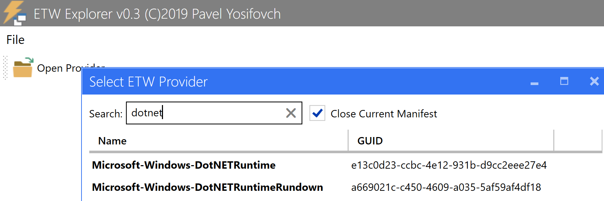

### what now?

this kind of turned into a spot to test detections for T1574.014

### ... how's that going?

not great :/ 

it's still looking like the easiest way to see this happening is capturing `Microsoft-Windows-Kernel-Process {22fb2cd6-0e7b-422b-a0c7-2fad1fd0e716}` `ImageLoad` events (EID 5), where `ImageCheckSum` is 0. There is some noise and false positives, but this still seems to be the most compact attribute-matching query.

## General Flow 

so I started off looking into what ETW events are available for dotnet events. Using etwxplorer, there were a couple providers I could look into.

To generate events, I'm using: 

https://github.com/cogphn/cs_scripts/tree/main/AppDomainManagerInjection_detect_test/test_evil

